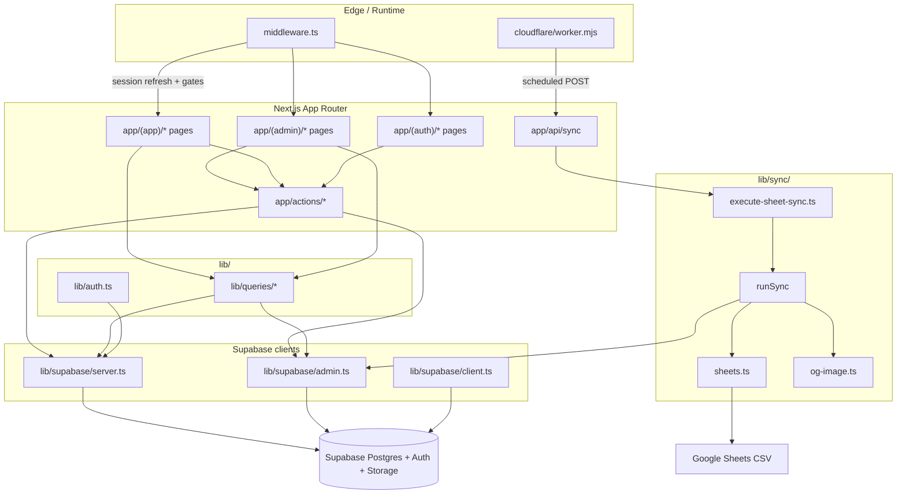

<!-- generated-by: gsd-doc-writer -->

# Architecture

## System overview

SEBRAEIERS is a gamified internal engagement platform for SEBRAE Goiás employees. Collaborators browse official social posts, declare engagement actions (like, comment, share), earn points after admin approval, and compete on a leaderboard. The application is a **Next.js 15 App Router** monolith with **server components** for reads, **server actions** for mutations, and **Supabase** (Postgres, Auth, Storage, RLS) as the data and identity backend. A **Google Sheets sync pipeline** imports posts from a spreadsheet into the database, triggered manually by admins or on a schedule via **Cloudflare Workers** cron. Production runs on **Cloudflare Workers** through `@opennextjs/cloudflare`, with R2-backed incremental caching.

Primary inputs: user credentials, engagement declarations, admin moderation decisions, and Google Sheets CSV rows. Primary outputs: timeline/ranking UI, admin dashboards, and persisted posts, check-ins, reactions, and comments.

## Component diagram



## Data flow

### Authentication and route protection

1. Every matched request passes through `middleware.ts`, which refreshes the Supabase session via cookie-based `createServerClient` from `@supabase/ssr`.
2. Public paths (`/`, `/login`, `/signup`, `/auth/*`, `/api/sync`, static assets) skip the auth gate.
3. Unauthenticated users on protected routes are redirected to `/login?next=<path>`.
4. `/admin/*` routes additionally require the user email to appear in `ADMIN_EMAILS` or `user.app_metadata.is_admin === true` in middleware; server layouts call `requireAdmin()` which checks `profiles.is_admin` in the database.

### Sign-up and profile bootstrap

1. `signUpAction` (`app/actions/auth.ts`) validates input with Zod, calls `supabase.auth.signUp`, and redirects to `/perfil`.
2. A Postgres trigger (`handle_new_user` in `supabase/migrations/0001_init.sql`) creates a `profiles` row and `user_socials` row on `auth.users` insert, promoting admins when `admin_email_hint` metadata matches or the email is in `admin_whitelist`.
3. Onboarding at `app/(onboarding)/perfil` uses `updateSocialsAction` to upsert social handles into `user_socials`.

### Timeline and engagement reads

1. Authenticated app pages under `app/(app)/` call `requireUser()` then `lib/queries/*` functions.
2. `getTimeline` fetches active `posts` with author profile joins, filtered by network and search.
3. `getPostsEngagementBatch` loads reaction counts, the current user's reactions, and comment counts from `post_reactions` and `post_comments`.
4. Server components render `components/posts/*` and `components/social/*` with this data; no client-side data fetching layer (no React Query/SWR).

### Check-in (points) workflow

1. User clicks an engage action on a post → `declareCheckinAction` inserts a `checkins` row with `status: 'pending'` and points derived from action type (1/2/3 for like/comment/share).
2. A unique constraint on `(user_id, post_id, action)` prevents duplicate declarations.
3. Admin reviews pending check-ins at `/admin/checkins` → `decideCheckinAction` calls the `decide_checkin` RPC (`supabase/migrations/0003_decide_checkin_rpc.sql`), which atomically updates status, records `checkin_approvals`, and sets points.
4. The `user_points` view aggregates approved check-ins for ranking; `getRanking` reads it via the service-role client to bypass RLS for the public leaderboard.

### Social reactions and comments

1. `app/actions/social.ts` handles post reactions (toggle), post comments, and check-in reactions/comments.
2. All mutations validate with Zod schemas from `lib/validation.ts`, use the cookie-scoped server Supabase client (subject to RLS), and call `revalidatePath` for affected routes.

### Admin post management

1. Admins create/edit posts via `app/actions/posts.ts`, optionally uploading cover images to Supabase Storage (`post-covers` bucket) through `getAdminClient()`.
2. `getAdminMetrics` (`lib/queries/metrics.ts`) aggregates counts and top performers using the service-role client.

### Google Sheets sync

1. **Scheduled (production):** Cloudflare cron (`0 */6 * * *` in `wrangler.jsonc`) runs `cloudflare/worker.mjs` `scheduled` handler, which POSTs to `/api/sync` with `x-cron-secret`.
2. **HTTP trigger:** `app/api/sync/route.ts` accepts GET or POST with `x-cron-secret` or `Authorization: Bearer <CRON_SECRET>`.
3. **Manual (admin UI):** `runSyncAction` in `app/actions/sync.ts` calls the same `runSync` core after verifying `profiles.is_admin`.
4. `runSync` (`lib/sync/index.ts`): fetches CSV from Google Sheets (`lib/sync/sheets.ts`), normalizes rows, skips story URLs, hashes `original_url` as `external_id`, optionally fetches OG images (`lib/sync/og-image.ts`), then upserts into `posts` via the admin client with `SYNC_AUTHOR_PROFILE_ID` as `created_by`.

## Key abstractions

| Abstraction | Location | Role |
|-------------|----------|------|
| `Profile`, `Post`, `Checkin`, `UserPoint` | `lib/types.ts` | Domain types and point/action constants |
| Zod schemas (`postSchema`, `checkinDeclareSchema`, etc.) | `lib/validation.ts` | Input validation at server-action boundaries |
| `createClient()` | `lib/supabase/server.ts` | Cookie-scoped Supabase client for RLS-enforced reads/writes |
| `getAdminClient()` | `lib/supabase/admin.ts` | Service-role client for sync, storage uploads, ranking, and admin metrics |
| `getClient()` | `lib/supabase/client.ts` | Browser Supabase client (singleton) |
| `requireUser()`, `requireAdmin()`, `getCurrentProfile()` | `lib/auth.ts` | Server-side auth guards for pages and actions |
| `getTimeline`, `getPostEngagement`, `getPostsEngagementBatch` | `lib/queries/posts.ts` | Post feed and engagement aggregation |
| `getRanking` | `lib/queries/ranking.ts` | Leaderboard from `user_points` view |
| `getAdminMetrics` | `lib/queries/metrics.ts` | Admin dashboard aggregates |
| `sortRanking`, `rankPosition` | `lib/ranking.ts` | Tie-break ordering for leaderboard display |
| `runSync`, `SyncSummary` | `lib/sync/index.ts` | Sheet-to-database post import orchestration |
| `fetchSheetCSV`, `parseColumns`, `detectNetwork` | `lib/sync/sheets.ts` | CSV fetch, column mapping, network detection |
| `executeSheetSync`, `verifyCronSecret` | `lib/sync/execute-sheet-sync.ts` | Cron-safe sync entry point for API route |
| `ActionResult` | `app/actions/auth.ts` | Standard `{ ok: true } \| { ok: false; error }` mutation result |
| `decide_checkin` RPC | `supabase/migrations/0003_decide_checkin_rpc.sql` | Atomic check-in approval/rejection with audit trail |

## Directory structure rationale

```
Sebraiers/
├── app/                    # Next.js App Router — routes, layouts, API, server actions
│   ├── (app)/              # Authenticated user routes (timeline, ranking, post detail)
│   ├── (admin)/            # Admin-only routes; layout calls requireAdmin()
│   ├── (auth)/             # Login and signup (public)
│   ├── (onboarding)/       # Profile setup after first sign-up
│   ├── actions/            # Server actions grouped by domain (auth, posts, checkins, social, sync, users)
│   └── api/sync/           # Cron/manual HTTP endpoint for sheet sync
├── components/             # React UI by feature (admin, forms, layout, posts, ranking, social, ui)
├── lib/                    # Server-safe business logic, queries, validation, Supabase clients
│   ├── queries/            # Read models for pages (posts, checkins, ranking, metrics)
│   ├── supabase/           # Three Supabase client factories (server, browser, admin)
│   ├── sync/               # Google Sheets import pipeline
│   └── social/             # Reaction emoji constants
├── supabase/               # Database migrations, seed data, local Supabase config
├── cloudflare/             # Worker entry that wraps OpenNext and adds cron trigger
├── tests/                  # Vitest unit and component tests
├── docs/                   # Project documentation (this file, brand guidelines)
├── middleware.ts           # Global auth session refresh and admin route gate
├── wrangler.jsonc          # Cloudflare Workers deploy config (R2 cache, cron, bindings)
├── open-next.config.ts     # OpenNext Cloudflare adapter (R2 incremental cache)
└── next.config.mjs         # Next.js config with OpenNext dev integration
```

**Why route groups?** Parentheses in `app/(app)`, `app/(admin)`, etc. organize layouts without affecting URLs. Each group applies different auth requirements: `(auth)` is public, `(app)` requires login, `(admin)` requires admin profile.

**Why split `lib/queries` from `app/actions`?** Queries are read-only, `server-only` data accessors used by server components. Actions are mutations invoked from client components via form actions or `useTransition`, keeping a clear read/write boundary.

**Why three Supabase clients?** The server client respects RLS with the user's session. The admin client bypasses RLS for operations that lack a user context (cron sync) or need elevated access (ranking view, storage uploads, aggregate metrics). The browser client supports any client-side Supabase needs.

**Why `lib/sync` is separate?** Sheet import is a distinct integration with its own parsing, OG scraping, and idempotency (`external_id` hash), shared by the API route, cron worker, and admin manual trigger.
